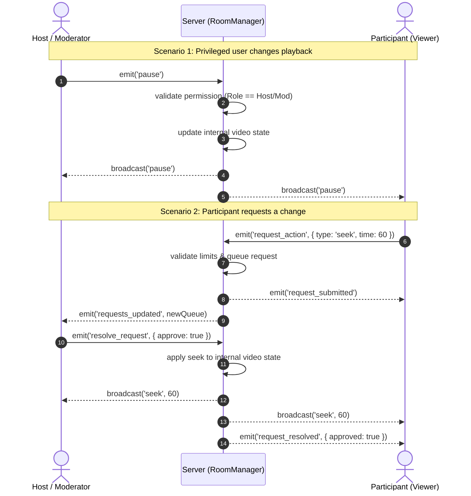

# Architecture Overview: WatchWave 

## 1. Technology Stack
* **Frontend:** React 19, TypeScript, and Vite. Utilizes `react-youtube` for the iframe player and a custom `SocketContext` provider for global real-time state management.
* **Backend:** Node.js and Express running a Socket.IO WebSocket server (written in TypeScript). 
* **Deployment:** Hosted as a unified full-stack web service on Render, where the Express backend serves the built React frontend static files to avoid cross-origin issues.

## 2. System Architecture & Data Flow

The following Mermaid diagram illustrates the WebSocket event flow, showing how the "Single Source of Truth" pattern handles both privileged actions (Host) and restricted actions (Participant).

## 3. Core Mechanics

* **Single Source of Truth:** The architecture avoids client-side conflicts by making the backend the absolute source of truth. The backend utilizes an Object-Oriented `RoomManager` class to encapsulate room state in memory. When a user clicks "pause", their local player does *not* pause immediately. Instead, they emit a `pause` event to the server. The server updates the internal room state and broadcasts a synchronized `pause` event to the entire room (including the sender), ensuring all clients react to the exact same ordered stream of events.
* **Time Extrapolation:** To solve synchronization issues for late joiners (or users suffering from network latency), the server calculates exactly where the video *should* be playing based on the server's clock before sending the `room_state` payload. This completely bypasses client clock skew.

## 4. Role-Based Access Control (RBAC) & Approvals
State mutation events (play, pause, seek, change_video) are strictly validated on the backend against the user's role (Host, Moderator, Participant) mapped to their unique `socket.id`. 
* If a privileged user (Host/Moderator) emits a playback event, it is broadcasted instantly.
* If a restricted user (Participant) attempts to change the video, the server intercepts it and places it into an **Approval Queue**. The server then pushes a `requests_updated` event to the Host/Moderators, who can approve or deny the action. 

## 5. Bonus Implementations Included
* **OOP Backend Design:** Encapsulated room logic into structured classes (`RoomManager`).
* **Text Chat:** Implemented a real-time shared chat panel in the room using localized socket broadcasting.
* **Host Transfer & Auto-Promotion:** A Host can manually transfer their role. Additionally, if a Host unexpectedly disconnects, the server automatically promotes a Moderator (or the oldest participant) to Host to ensure the room never enters a dead state.
